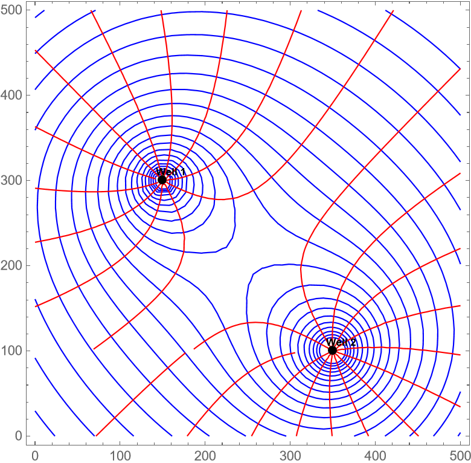

---

##### Download

+ [Project](final_project.pdf)
+ [Code](/projects/project1/final_project.nb)

---

##### Abstract

This project involves modeling groundwater flow around pumping wells in confined and unconfined aquifers using discharge potential theory. Building on the analytical framework presented by [Korkmaz (2017)](https://www.ewra.net/ew/pdf/EW_2017_57_52.pdf), the study focuses on steady-state flow in confined, unconfined, and combined aquifer systems by leveraging the linearity of Laplace’s equation and the principle of superposition. The analytical solutions are extended to heterogeneous and anisotropic aquifers through coordinate transformations. Additionally, the classical Theis equation [(Theis, C.V. 1935)](https://doi.org/10.1029/TR016i002p00519) is employed to model transient (time-dependent) flow around two pumping wells in an unconfined aquifer system.

The implementation begins with a 1D solution for groundwater flow using discharge potential in both confined and unconfined zones, followed by a 2D radial flow model around a single well. Discharge potential and stream function solutions for a single well are generalized to two-well systems using superposition for both homogeneous isotropic and heterogeneous anisotropic aquifers. The final segment of the code implements transient flow modeling to compute the evolution of hydraulic head and discharge potential over time.

---

##### Figure 1: Flownet around a single well (Discharge potential, Stream function, and Hydraulic head)

##### Figure 2: Contour plot of equipotentials and streamlines for 2 wells in an unconfined aquifer (Homogeneous and Isotropic)

##### Figure 3: Contour plot of equipotentials and streamlines for 2 wells in an unconfined aquifer with a uniform flow (Homogeneous and Isotropic)

##### Figure 4: Flow Net: Discharge and Stream Functions (Heterogeneous and Anisotropic unconfined aquifer)

##### Figure 5: Hydraulic Head distribution (Heterogeneous and Anisotropic unconfined aquifer)

---

<!-- ##### Related material

+ [Presentation slides](presentation2.pdf)
+ [Wikipedia entry](https://en.wikipedia.org/wiki/The_Finer_Points_of_Sausage_Dogs) -->
