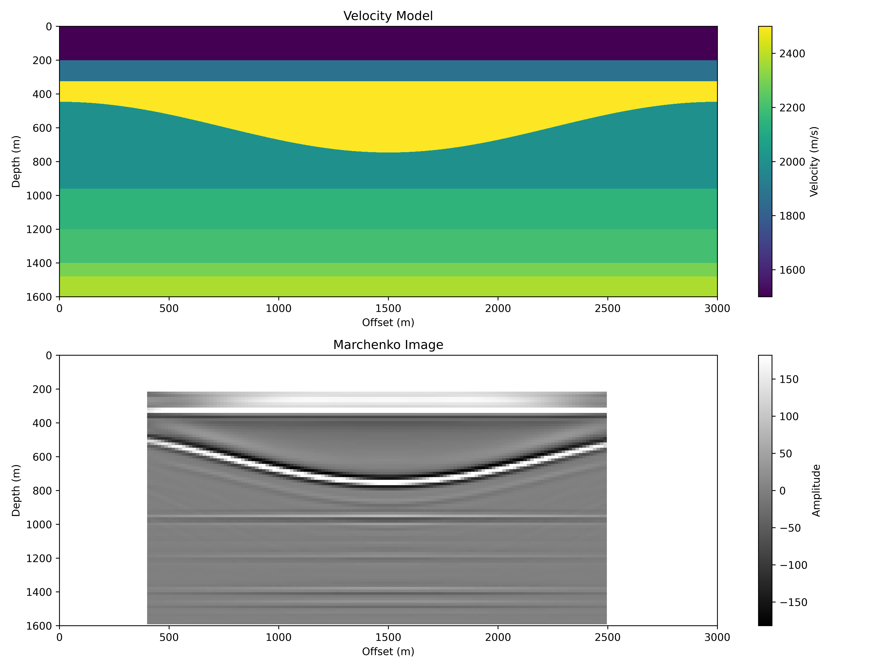

---

##### Download  

The input files used in the code below can be downloaded [here](goal.com). The `DATA` folder contains two sub-folders:  
- `DAT` folder containing files with `.dat` extensions  
- `MAT` folder containing files with `.mat` extensions  

The code below uses files from the `MAT` folder. The files in the `DAT` folder are the original data provided by the authors.  

**Note:** Users of the Python code below do not need to run the `data_preparation()` function unless they want to work with `.npy` files.  `data_preparation()` function load the `.dat` files in `DAT`, reshape appropriately, and save to `.mat` and `.npy` format. 

---

+ [Green Function Estimation 1](/projects/project3/Marchenko.py)
+ [Green Function Estimation 2](/projects/project3/Marchenko2.py)
+ [Marchenko Imaging](/projects/project3/Marchenko_Imaging.py)

---

##### Abstract

*MarchenCode* contains Python code to compute the Green's functions from single-sided surface reflectivity data. Learners will also find code to perform Marchenko-based imaging using decomposed Green’s functions (upgoing). I embarked on this project in an effort to understand the Marchenko method. For learners proficient in MATLAB, you can download the original version of the code in MATLAB [here](https://wiki.seg.org/wiki/Software:Marchenko_for_imaging) by [`Angus Lomas and Andrew Curtis`](https://www.geos.ed.ac.uk/~acurtis/assets/Lomas_Curtis_Geop_March_2019.pdf)

---

##### Figure 1: Input Shot Gather

##### Figure 2: Focusing Functions (Initial and After 5 Iterations)

##### Figure 3: Estimated Green's Function

##### Figure 4: Marchenko Imaging

A look at the output from the tqdm (**taqaddum**, which mean progress in arabic) progress bar `132/132 [36:28:28<00:00, 994.76s/it]` indicates:

1. There are 132 iterations..

2. **Total Runtime**: 36 hours, 28 minutes, and 28 seconds (extremely slow).

3. **Per-Iteration Time**: ~994.76 seconds (16.6 min) per point, indicating inefficiency.

The progress bar reveals the computation is **`super slow`**. It should be noted that the imaging grid does not include all the full coordinates. The imaging grid ranges from 400m - 2500m (x position) and 200m - 1600m (z position) at 16m spacing. So, interested learners should consider improving the performance of the code significantly.

##### Key Reference

`Lomas, Angus, and Andrew Curtis`. "An introduction to Marchenko methods for imaging." *Geophysics* 84, no. 2 (2019): F35-F45.

---
