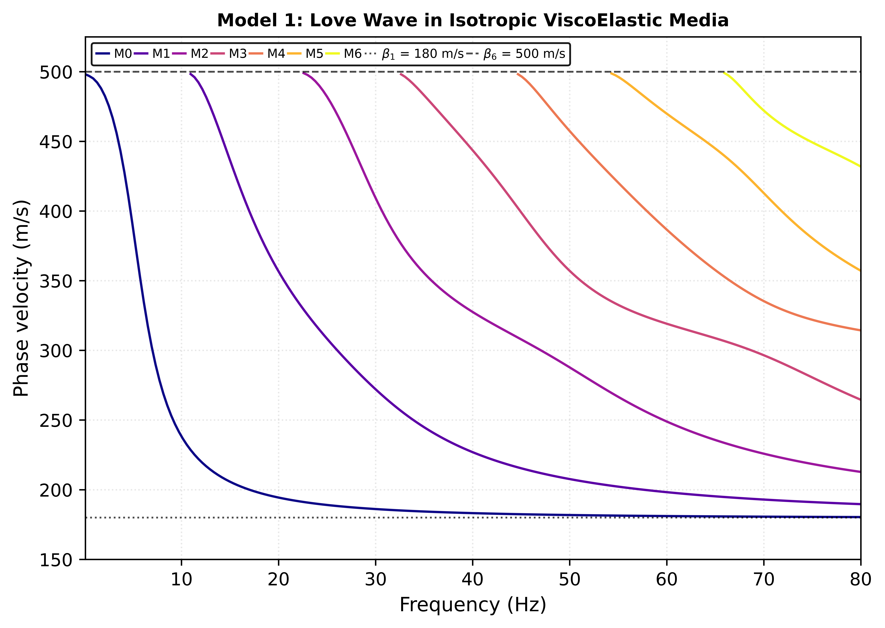
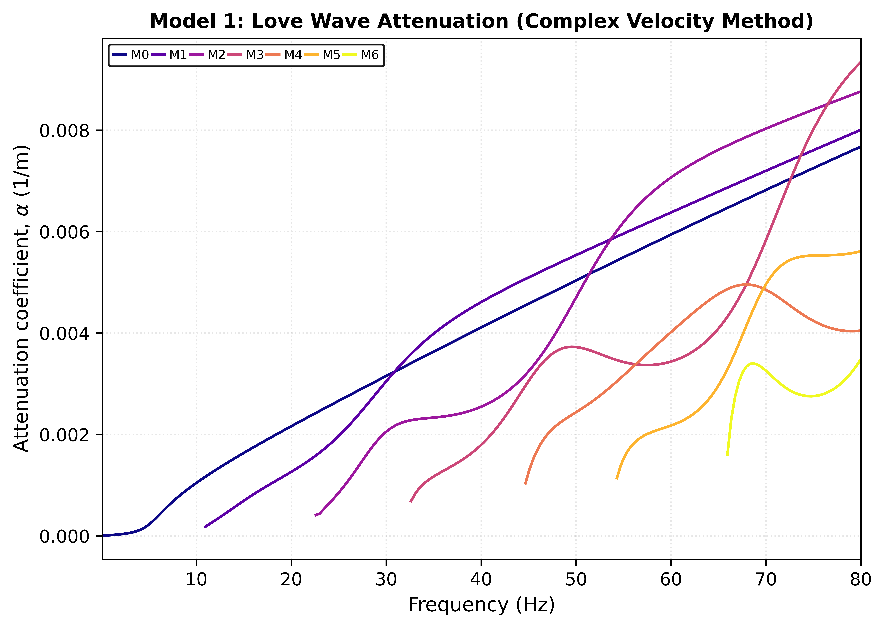
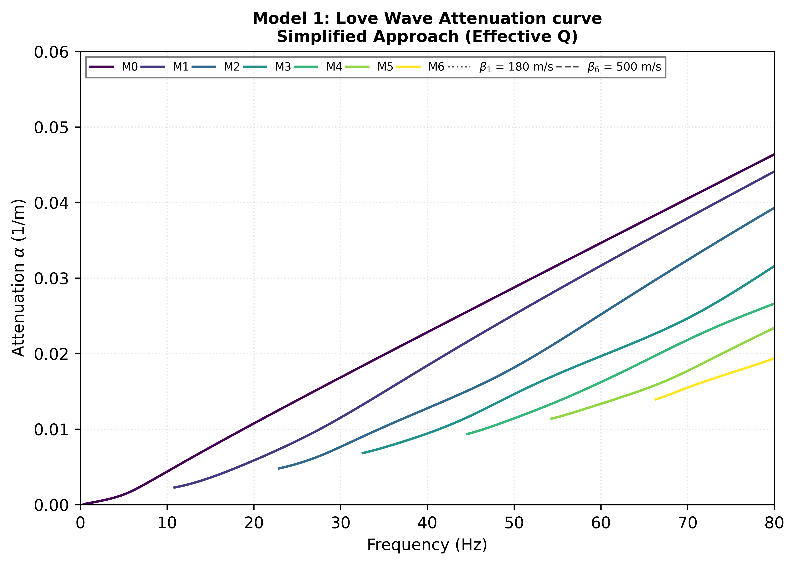

---

##### Download

<!-- + [Code 1](/projects/project2/Acoustic_Wave_Modelling.py)
+ [Code 2](/projects/project2/2D%20Acoustic%20Wave%20Equation.py)  
  The velocity models (`model1.npy` and `model2.npy`) used in the modelling can be downloaded [here](https://github.com/hoyekan/hoyekan.github.io/tree/main/content/projects/project2) -->

+ [Dispersion and Attenuation of Love Waves in a Stack of N Isotropic Viscoelastic Layers over a Half-Space – A Thomson–Haskell Propagator Matrix Approach](/projects/project4/dispersion_love_waves_thomson_haskell.pdf)
+ [Code](/projects/project4/Complex_Velocity_Method.ipynb)

---

##### Abstract

This project presents a comprehensive modelling approach for analyzing Love wave propagation in a stratified medium consisting of $N$ isotropic viscoelastic shear layers overlying a semi-infinite half-space. The theoretical formulation employs the Thomson-Haskell propagator matrix method ([Haskell (1953)](#haskell-1953) and [Thomson (1950)](#thomson-1950)) as implemented in [Chen k. et al. (2025)](#Chenetal2025) to relate state vectors—comprising displacement and shear stress—across layer interfaces, effectively linking the half-space to the free surface.To account for realistic material damping, the study incorporates the Generalized Maxwell Body (GMB) model (Maxwell-Wiechert model), which utilizes a superposition of multiple Maxwell elements to simulate a frequency-independent quality factor ($Q$) over the seismic frequency bandwidth.The project derives the complex dispersion equation by applying traction-free boundary conditions at the surface and radiation conditions in the half-space. Finally, a numerical algorithm is implemented to solve the dispersion function, generating phase velocity and attenuation coefficient curves that characterize the dispersive and dissipative properties of the viscoelastic multilayered system.

Model 1, Model 3, and 4 used in the project are from [Yuan S. et al (2024)](#Yuanetal). The attenuation coefficient is computed via complex velocity and a simplified Q averaging approach.

---

##### Figure 1: Phase Velocity Dispersion Curve

##### Figure 2: Attenuation Coefficient Curve (Using Complex Velocity Method)

$$
k = \frac{\omega}{c^*}
$$

It follows that if $ k $ is complex ($ k = k_r - i\alpha $), $ c^* $ must also be complex and vice versa. Let's express the complex velocity in terms of its real and imaginary parts. The standard convention is:

$$
c^* = c_r + i c_i
$$

where $ c_i $ is typically negative, representing loss.

Now, let's find the formula for $ \alpha $:

$$
k = k_r - i\alpha = \frac{\omega}{c^*} = \frac{\omega}{c_r + i c_i}
$$

To separate the real and imaginary parts, we multiply the numerator and denominator by the complex conjugate of the denominator:

$$
k_r - i\alpha = \frac{\omega}{(c_r + i c_i)} \cdot \frac{(c_r - i c_i)}{(c_r - i c_i)} = \frac{\omega (c_r - i c_i)}{c_r^2 + c_i^2}
$$

Now, equate the real and imaginary parts from both sides:

- **Real Part:** $ k_r = \dfrac{\omega c_r}{c_r^2 + c_i^2} $
- **Imaginary Part:** $ -\alpha = \dfrac{-\omega c_i}{c_r^2 + c_i^2} $

From the imaginary part, we get the primary formula:

$$
\boxed{\alpha = \frac{\omega c_i}{c_r^2 + c_i^2}}
$$

$$
\alpha = \frac{\omega , \text{Im}(c)}{|c|^2} \approx \frac{\omega c_i}{c_r^2} \quad \text{for small } c_i
$$

For most geophysical problems, $c_i \ll c_r$, so this is valid.

This is the general formula for the attenuation coefficient in terms of the complex velocity $ c^* = c_r + i c_i $

---

##### Figure 3: Attenuation Coefficient Curve (Simplified Q averaging)
This assumes that attenuation is very small $(Q \gg 1)$ and its computed using the Kolsky-Futterman model (see attached code for derivation).

For small attenuation ($Q \gg 1$), the standard formulation is:

$$
\frac{1}{c^*} \approx \frac{1}{c} \left( 1 + \frac{i}{2Q} \right)
$$

where $c$ is the real-valued phase velocity at low loss.

Starting from the wavenumber:

$$
k = \frac{\omega}{c^*} \approx \frac{\omega}{c}
\left( 1 + \frac{i}{2Q} \right)
= \frac{\omega}{c} + i \frac{\omega}{2cQ}
$$

Comparing this to $k = k_r + i\alpha$, we identify:

$$
\boxed{\alpha \approx \frac{\omega}{2cQ}}
$$

##### Figure 4: The Love-wave modal solutions in the frequency-phase velocity-attenuation coefficient domain.

---

##### Key Reference

`Yuan, S., Pan, L., Shi, C., Song, X., & Chen, X.` ***Computation and analysis of surface wave dispersion and attenuation in layered viscoelastic–vertical transversely isotropic media by the generalized R/T coefficient method.*** *Geophysical Journal International* 238, no. 3 (2024): 1505–1529.

`Chen, K., Li, Z., Wang, M., & Sacchi, M. D.` ***Theoretical calculation of dispersion and attenuation curves of deep-guided wave in viscoelastic media.*** *Geophysical Journal International* 243, no. 3 (2025): ggaf393.

`Haskell, N. A.` ***The dispersion of surface waves on multilayered media.*** *Bulletin of the Seismological Society of America* 43 (1953): 17–34.

`Thomson, W. T.` ***Transmission of elastic waves through a stratified solid medium.*** *Journal of Applied Physics* 21, no. 2 (1950): 89–93.

