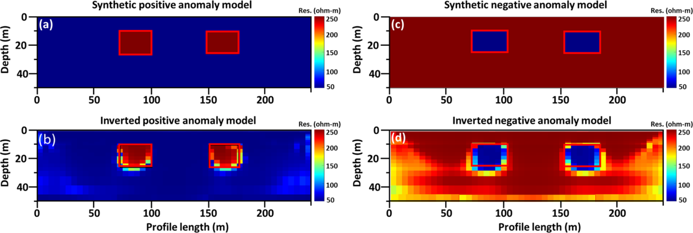

---

##### Download

+ [You can find the paper online here.](https://doi.org/10.1038/s41598-024-78744-1)
+ [Download the PDF.](paper1.pdf)

---

##### Abstract

Geophysical DC resistivity imaging is crucial in subsurface exploration, environmental studies, and resource assessment. However, traditional inversion techniques face challenges in accurately resolving complex subsurface features due to the inherent nonlinearities in geophysical data. 

To address these challenges, we propose a hybrid optimization approach that combines Incomprehensible but Intelligible-in-Time (IbI) logic with the interior point method (IPM). The IbI logic framework leverages temporal intelligibility to dynamically interpret subsurface phenomena. By integrating IbI with IPM, our approach benefits from both global exploration and local refinement, leading to improved convergence speed and solution quality.

The objective function formulated for the inversion process includes data misfit and model regularization terms, promoting accurate and smooth solutions. Our methodology employs the IbI Logic Algorithm (ILA) for the initial global search to identify promising regions in the search space, followed by IPM for local optimization. This synergy ensures robustness and efficiency in handling large datasets and complex geological models.

We validated our approach using synthetic and real DC resistivity data. The synthetic tests demonstrated accurate reconstruction of subsurface anomalies, while the real data application successfully identified fault zones consistent with prior studies. The proposed hybrid optimization algorithm significantly enhances the resolution of subsurface structures and improves geophysical data inversion practices by effectively balancing exploration and refinement phases, optimizing computation time, and ensuring precise model delineation.


---

<!--##### Figure 5: Display and comparison of the (a) synthetic positive anomaly DC resistivity model, (b) positive anomaly inverted resistivity model, (c) synthetic negative anomaly DC resistivity model, and (d) negative anomaly inverted resistivity model.-->

##### Figure 5:  
**Display and comparison of:**  
(a) Synthetic positive anomaly DC resistivity model  
(b) Inverted model for positive anomaly  
(c) Synthetic negative anomaly DC resistivity model  
(d) Inverted model for negative anomaly



---

##### Citation

Edigbue, Paul, Hammed Oyekan, Abdullatif Al-Shuhail, and Sherif Hanafy. "Hybrid optimization for DC resistivity imaging via intelligible-in-time logic and the interior point method." *Scientific Reports* 14, no. 1 (2024): 27558.


```BibTeX
@article{edigbue2024hybrid,
  title={Hybrid optimization for DC resistivity imaging via intelligible-in-time logic and the interior point method},
  author={Edigbue, Paul and Oyekan, Hammed and Al-Shuhail, Abdullatif and Hanafy, Sherif},
  journal={Scientific Reports},
  volume={14},
  number={1},
  pages={27558},
  year={2024},
  publisher={Nature Publishing Group UK London}
}
```
