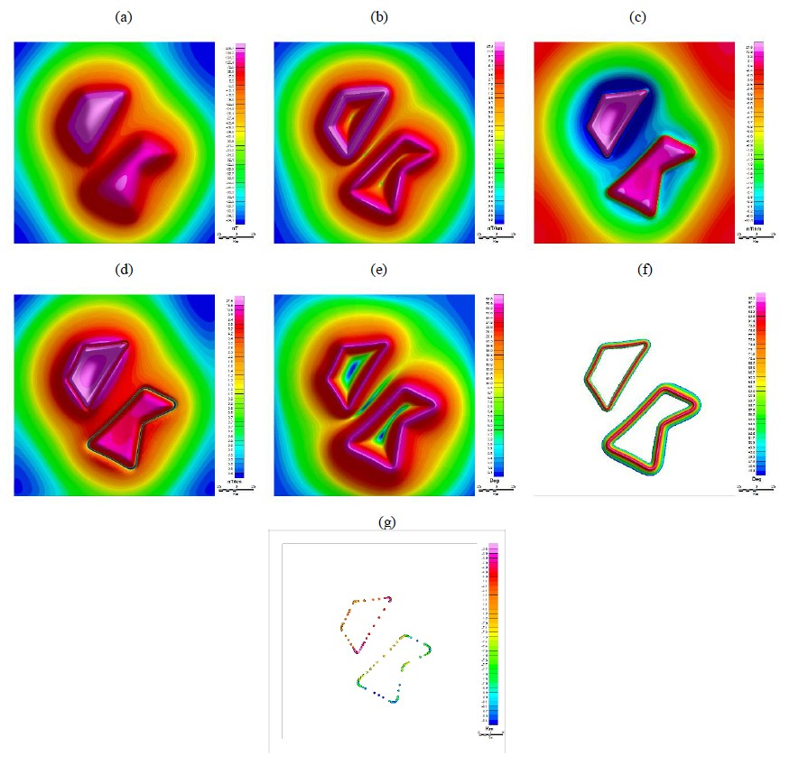
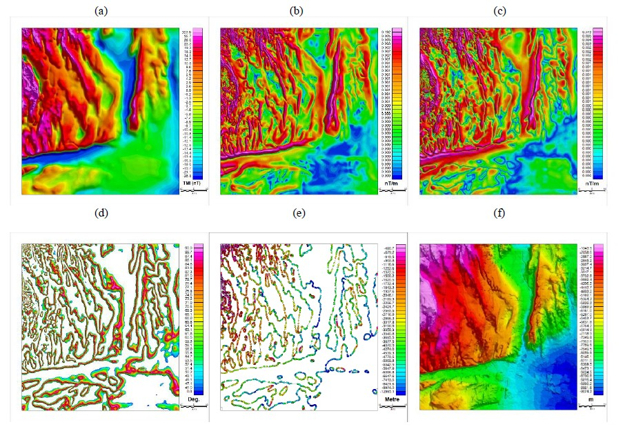

---

##### Downloads
- [You can find the paper online here](https://doi.org/10.3997/2214-4609.2024101566)  
- [Download the PDF](paper2.pdf)
- [arXiv](https://doi.org/10.48550/arXiv.2505.22780)

---

##### Abstract
Accurate depth estimation of magnetic sources plays a crucial role in various geophysical applications, including mineral exploration, resource assessments, regional hydrocarbon exploration, and geological mapping. Thus, this abstract presents a fast and simple method of estimating the depth of a magnetic body using the TDX derivative of the total magnetic field. TDX is a first-order derivative of the magnetic field that, in addition to edge detection, is less affected by noise, allowing for better depth resolution. The reduced sensitivity to noise enables a clearer estimation of depth and enhances the accuracy of the depth determination process. The TDX, as a variant of the phase derivative, is independent of magnetization and can be used to identify the edge of a magnetic body. In addition to excelling at edge detection, they can also estimate the depth of the magnetic source producing the anomalies. In this study, we explore the utilization of contour of the TDX derivative for estimating depth, assuming a vertical contact source. We demonstrate the effectiveness of the method using a two-prism block model and a simple bishop model with a uniform susceptibility of 0.001 cgs. The results agree with the known depth, providing evidence of the reliability of the method despite the restrictive nature of the assumption, especially for the Bishop model, where there are numerous fault structures.

---

##### Figure 2: 
##### Two prism Model (a) Total Magnetic Intensity, (b) Total Horizontal Derivative, (c) Vertical Derivative, (d) Absolute value of Vertical Derivative, |VDR|, (e) TDX map, (f) contour of interest, 45° ≤ TDX ≤ 90°, and (g) Estimated depth along the depth of the block.

 <br>

#### Figure 3: 
##### Bishop Models. (a) TMI response generated from the basement model, with uniform magnetic basement susceptibility, RTP’ed, and field strength of 50,000nT, (b) Total Gradient of the field, (c) Absolute value of the Vertical derivative, (d) TDX map between 45° and 90°, (e) Estimated depth along the edge of the block, and (f) Topography of the Model Magnetic Basement



---

##### Citation
Oyekan, H. "Depth to Magnetic Source Estimation Using TDX Contour." In 85th EAGE Annual Conference & Exhibition (including the Workshop Programme), vol. 2024, no. 1, pp. 1-5. European Association of Geoscientists & Engineers, 2024.

```bibtex
@inproceedings{oyekan2024depth,
  title={Depth to Magnetic Source Estimation Using TDX Contour},
  author={Oyekan, H},
  booktitle={85th EAGE Annual Conference \& Exhibition (including the Workshop Programme)},
  volume={2024},
  number={1},
  pages={1--5},
  year={2024},
  organization={European Association of Geoscientists \& Engineers}
}
